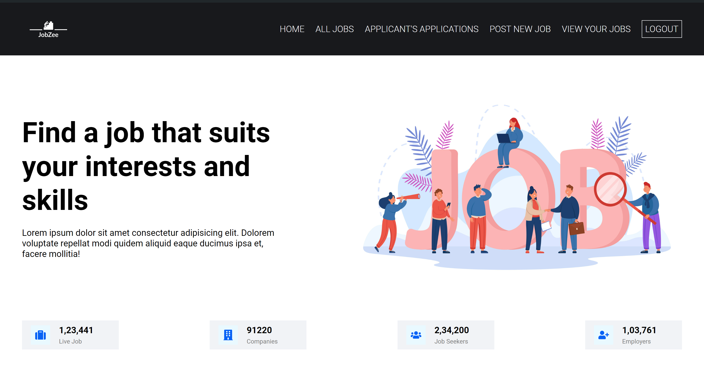
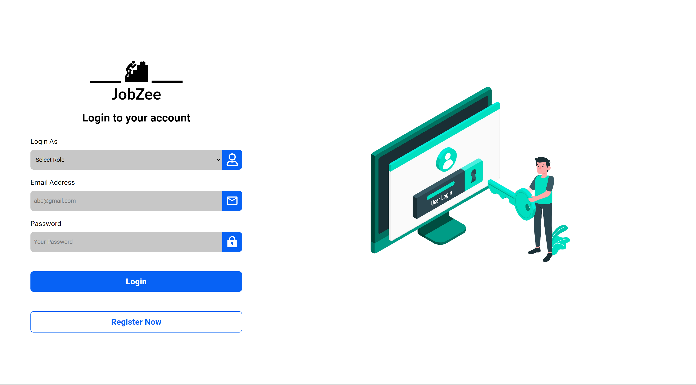
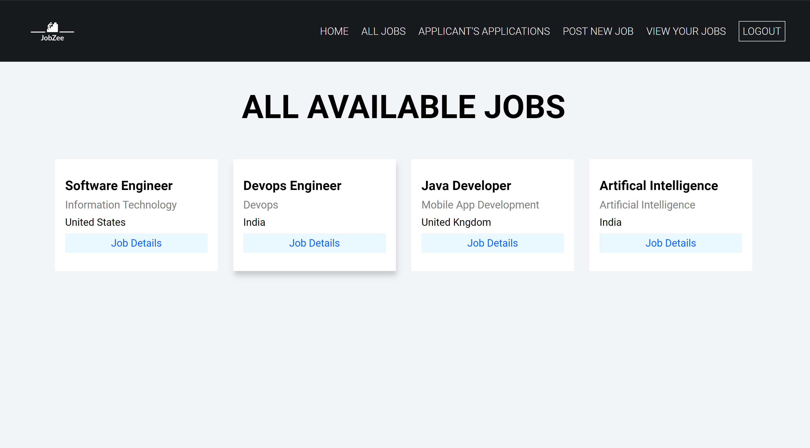
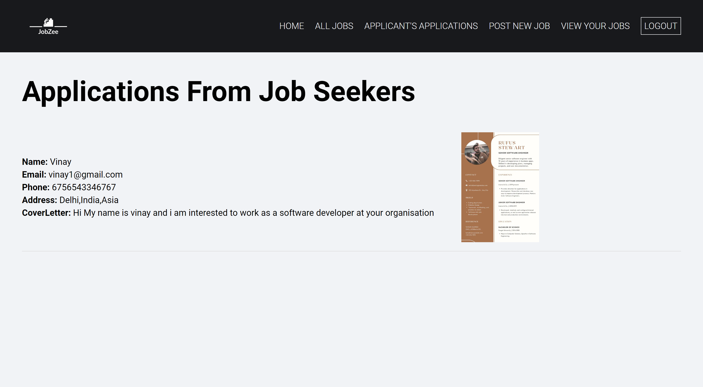
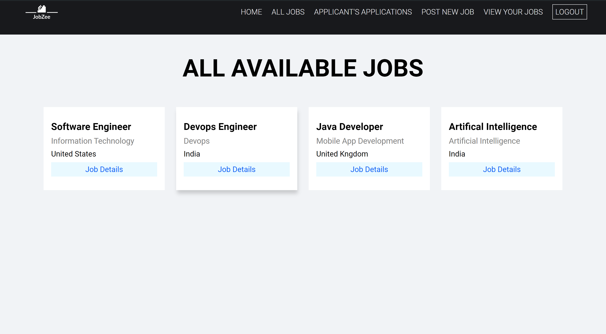
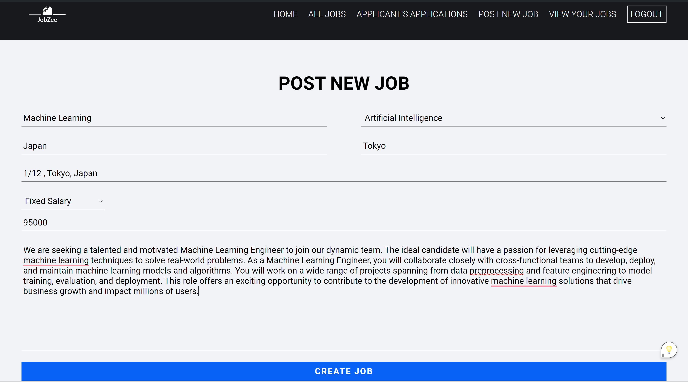
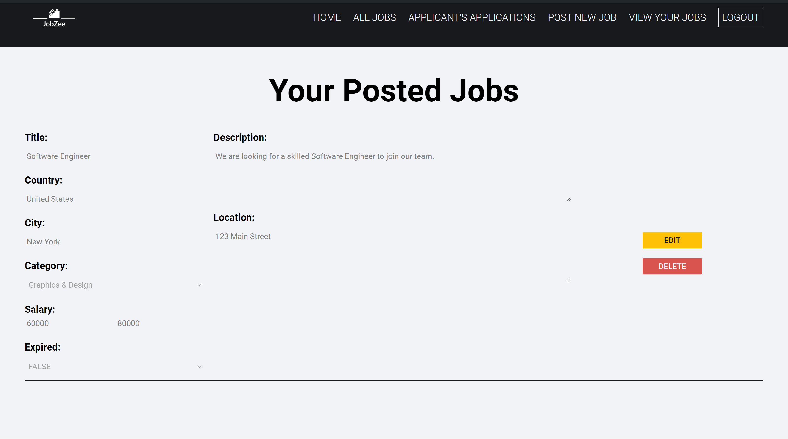

# Job Seeking Project

Welcome to the Job Seeking Project! This project aims to provide a platform for job seekers to find suitable job opportunities and for employers to post job vacancies.

## Features

### For Job Seekers

- **User Authentication:** Job seekers can create an account, login, and logout securely.

- **Job Search:** Job seekers can search for job openings based on various criteria such as job title, location, industry, etc.

- **Apply to Jobs:** Users can apply to job postings directly through the platform.

- **Application Tracking:** Job seekers can track the status of their job applications and view their application history.

- **Edit Applications:** Users can edit their job applications before submission.

- **View All Jobs:** Job seekers can browse and view all available job postings.

### For Employers

- **User Authentication:** Employers can create an account, login, and logout securely.
- **Post New Job:** Employers can post job vacancies by providing detailed job descriptions, requirements, and application instructions.

- **Application Management:** Employers can view and manage job applications received for their postings.

- **Edit Job Postings:** Employers can edit or update job postings as needed.

- **View Applicant Applications:** Employers can view and review applications submitted by job seekers.

## Technologies Used

- **Frontend:** HTML, CSS, JavaScript, React.js
- **Backend:** Node.js, Express.js, MongoDB
- **Authentication:** JSON Web Tokens (JWT)
- **Database:** MongoDB Atlas

## Setup Instructions

1. Clone the repository to your local machine.
2. Navigate to the `frontend` directory and run `npm install` to install frontend dependencies.
3. Navigate to the `backend` directory and run `npm install` to install backend dependencies.
4. Create a MongoDB database and configure the connection URI in the backend `.env` file.
5. Run the backend server using `npm start` in the `backend` directory.
6. Run the frontend server using `npm start` in the `frontend` directory.
7. Access the application in your web browser at `http://localhost:3000`.

## Contributions

Contributions to the project are welcome! If you have any suggestions, bug fixes, or feature enhancements, feel free to open an issue or create a pull request.

## Contact

For any inquiries or support, please contact us at vinaychandramola4@example.com. We're here to help!
